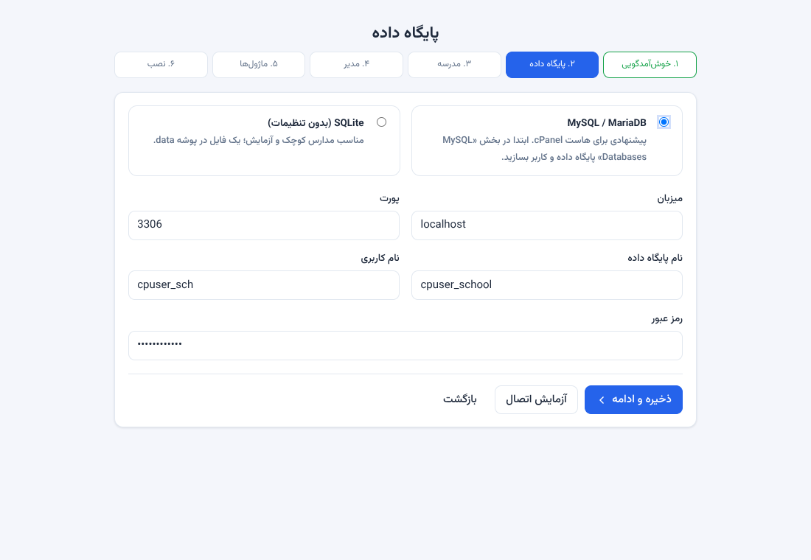
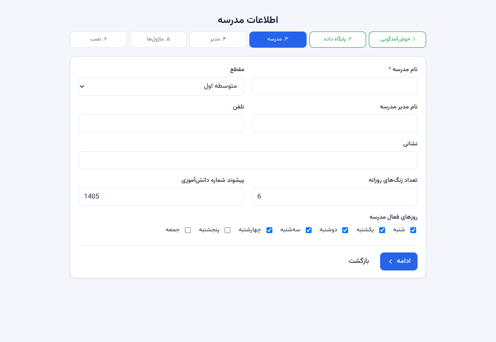
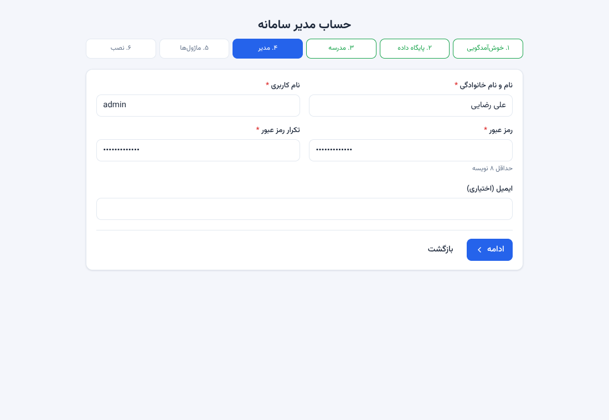
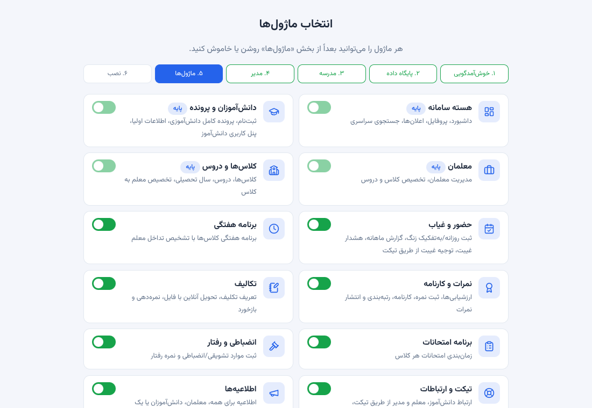
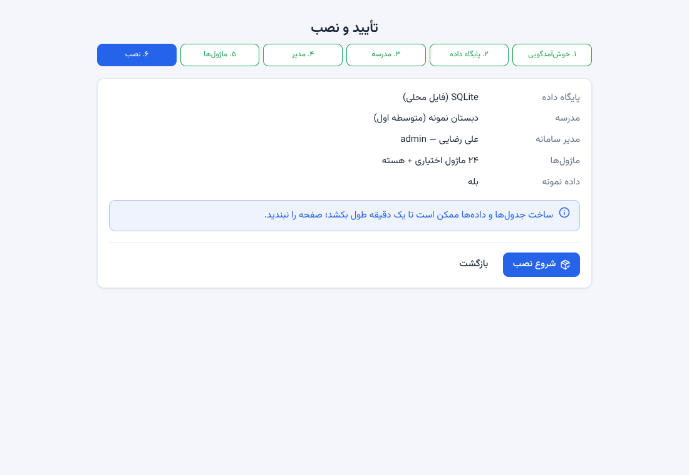
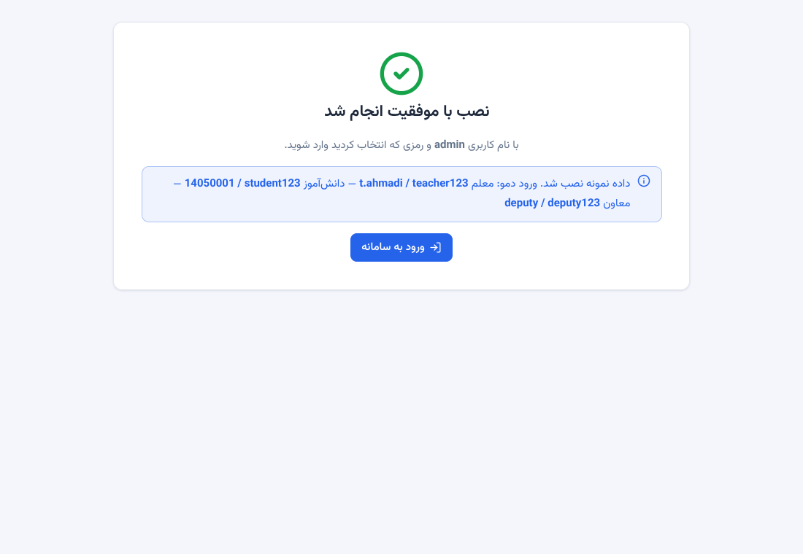

# نصب روی cPanel **بدون SSH** — با دمو و بدون دمو

این راهنما برای کسی است که فقط به **پنل cPanel در مرورگر** دسترسی دارد (بدون SSH و بدون Terminal). همه‌ی کارها با این ابزارهای خود cPanel انجام می‌شود:

| ابزار cPanel | برای چه؟ |
|---|---|
| **File Manager** | آپلود و استخراج فایل‌ها، ساخت پوشه، تغییر مجوز، دیدن لاگ |
| **MySQL® Databases** | ساخت پایگاه داده و کاربر |
| **phpMyAdmin** | (فقط در موارد خاص) پاک‌کردن جدول‌ها |
| **Setup Node.js App** | ساخت اپلیکیشن، نصب وابستگی‌ها، Restart، اجرای اسکریپت |
| **Cron Jobs** | کارهای خودکار (پشتیبان، قفل نمره، یادآوری اقساط، …) |
| **SSL/TLS Status** | گواهی https |

> راهنمای تکمیلی با جزئیات بیشتر (و روش‌های Terminal برای کسانی که SSH دارند): [CPANEL.md](CPANEL.md).

## فهرست
1. [کدام نصب را می‌خواهم؟ (با دمو / بدون دمو)](#۱-کدام-نصب-را-می‌خواهم)
2. [پیش از شروع](#۲-پیش-از-شروع)
3. [مرحله ۱ — گرفتن و آپلود فایل‌ها](#۳-مرحله-۱--گرفتن-و-آپلود-فایل‌ها)
4. [مرحله ۲ — ساخت پایگاه داده](#۴-مرحله-۲--ساخت-پایگاه-داده)
5. [مرحله ۳ — ساخت اپلیکیشن Node.js](#۵-مرحله-۳--ساخت-اپلیکیشن-nodejs)
6. [مرحله ۴ — ویزارد نصب (با تصویر)](#۶-مرحله-۴--ویزارد-نصب)
7. [روش دوم برای دمو: نصب بدون ویزارد (Run JS script)](#۷-روش-دوم-برای-دمو-نصب-بدون-ویزارد)
8. [تغییر نوع نصب: دمو ← واقعی و برعکس](#۸-تغییر-نوع-نصب)
9. [سایت دموی عمومی با بازنشانی شبانه](#۹-سایت-دموی-عمومی-با-بازنشانی-شبانه)
10. [کارهای بعد از نصب (امنیت، Cron، پشتیبان، پیامک)](#۱۰-کارهای-بعد-از-نصب)
11. [به‌روزرسانی](#۱۱-به‌روزرسانی)
12. [بازنشانی رمز مدیر بدون SSH](#۱۲-بازنشانی-رمز-مدیر-بدون-ssh)
13. [عیب‌یابی](#۱۳-عیب‌یابی)
14. [برگه‌ی مرجع سریع](#۱۴-برگه‌ی-مرجع-سریع)

---

## ۱. کدام نصب را می‌خواهم؟

| | **بدون دمو (نصب واقعی)** | **با دمو** |
|---|---|---|
| داده‌ی اولیه | خالی؛ فقط حساب مدیر و تنظیمات پایه | ۶ کلاس، ۷۲ دانش‌آموز، معلم‌ها، برنامه، نمرات، حضور و غیاب، تیکت، مالی، اعلانات |
| برای چه؟ | استفاده‌ی واقعی در مدرسه | آشنایی با سامانه، آموزش کارکنان، نمایش به مشتری |
| حساب‌های ورود | فقط مدیری که خودتان می‌سازید | مدیر + معاون + دو معلم + دانش‌آموز + ولی (رمزها عمومی‌اند) |
| ریسک | — | رمزهای عمومی؛ **هرگز برای اطلاعات واقعی** |
| کجا انتخاب می‌شود؟ | ویزارد، گام ماژول‌ها: تیک «دمو» **خاموش** | ویزارد، گام ماژول‌ها: تیک «دمو» **روشن** |

**قاعده‌ی طلایی:** دمو و داده‌ی واقعی را در یک نصب قاطی نکنید. اگر هر دو را می‌خواهید، **دو اپلیکیشن جدا** با **دو پایگاه داده‌ی جدا** بسازید (مثلاً `demo.example.com` و `school.example.com`). هر دو با همین راهنما ساخته می‌شوند.

---

## ۲. پیش از شروع

### ۲-۱. هاست شما باید داشته باشد
- **Setup Node.js App** در cPanel (اگر نیست، از پشتیبانی هاست بخواهید فعال کند؛ بدون آن نصب ممکن نیست).
- **Node.js ۱۸ یا بالاتر** (۲۰ یا ۲۲ پیشنهاد می‌شود).
- **MySQL/MariaDB**.
- **SSL** برای دامنه (cPanel ← **SSL/TLS Status** ← **Run AutoSSL**).
- حداقل ۲۵۶ مگابایت حافظه (۵۱۲ بهتر).

### ۲-۲. یادداشت‌هایی که در طول کار لازم می‌شود
یک فایل متنی باز کنید و این‌ها را آماده/یادداشت کنید:

```
دامنه یا زیردامنه:        ..........................
نام پوشه‌ی اپلیکیشن:      school        (یا demo)
نام کامل پایگاه داده:      ..........................  (با پیشوند cPanel)
نام کامل کاربر دیتابیس:   ..........................  (با پیشوند cPanel)
رمز کاربر دیتابیس:        ..........................
نام کاربری مدیر:          ..........................
رمز مدیر (حداقل ۸ نویسه):  ..........................
```

> **چرا یادداشت؟** نام پایگاه داده و کاربر در cPanel همیشه با پیشوند حساب شما شروع می‌شود (مثلاً `cpuser_school`)، و ویزارد همان نام کامل را می‌خواهد.

---

## ۳. مرحله ۱ — گرفتن و آپلود فایل‌ها

### ۳-۱. گرفتن فایل‌ها روی کامپیوتر خودتان
1. صفحه‌ی مخزن پروژه را در گیت‌هاب باز کنید: `https://github.com/diswebir/mad3`.
2. شاخه‌ی مورد نظر را انتخاب کنید (نسخه‌ی ۲٫۱٫۰ روی شاخه‌ی `arena/01a0f6f5-mad3` است تا وقتی که PR شماره‌ی ۱ را merge کنید و روی `main` بیاید).
3. **Code ← Download ZIP**. فایلی مثل `mad3-arena-01a0f6f5-mad3.zip` دانلود می‌شود.
   - **نیازی نیست آن را روی کامپیوتر باز کنید.** خود فایل ZIP را آپلود می‌کنید.

### ۳-۲. آپلود در cPanel
1. cPanel ← **File Manager**.
2. در ستون سمت چپ روی پوشه‌ی خانگی (`/home/نام‌کاربری‌شما`) کلیک کنید.
   - ⚠️ **داخل `public_html` نروید.** برنامه باید بیرون از آن باشد تا پوشه‌ی `data` (شامل مشخصات دیتابیس) از وب در دسترس نباشد.
3. **+ Folder** ← نام `school` (برای دمو: `demo`) ← **Create New Folder**.
4. وارد پوشه‌ی `school` شوید ← **Upload** ← فایل ZIP را بکشید/انتخاب کنید ← صبر کنید تا ۱۰۰٪ شود ← **Go Back to ...**.
5. فایل ZIP را انتخاب کنید ← **Extract** (بالای صفحه) ← مسیر استخراج همان `/home/.../school` ← **Extract File(s)** ← Close.

### ۳-۳. جابه‌جایی پوشه‌ی تو در تو (**مرحله‌ی حیاتی**)
ZIP گیت‌هاب همه‌چیز را داخل یک پوشه‌ی اضافی می‌گذارد (مثل `mad3-arena-01a0f6f5-mad3`). برنامه باید **مستقیم** داخل `school` باشد:
1. وارد پوشه‌ی استخراج‌شده شوید (همان پوشه‌ی تو در تو).
2. **Select All** (بالای صفحه) ← **Move** ← مسیر مقصد را به `/home/.../school` تغییر دهید ← **Move File(s)**.
3. به `school` برگردید. پوشه‌ی خالی تو در تو و فایل ZIP را حذف کنید (Delete).
4. **بررسی:** در `school` باید این‌ها را مستقیم ببینید: `app.js`، `package.json`، پوشه‌های `src`، `views`، `public`، `scripts`، `data`، `docs`.
   - اگر `package.json` را نمی‌بینید، مرحله‌ی ۳ را درست انجام نداده‌اید.
   - مطمئن شوید گزینه‌ی **Settings ← Show Hidden Files (dotfiles)** برای دیدن فایل‌های مخفی روشن است (لازم نیست، فقط اگر فایل‌های نقطه‌دار را می‌خواهید ببینید).
5. اگر پوشه‌ی `data` نیست: **+ Folder** ← `data`. سپس روی `data` راست‌کلیک ← **Change Permissions** ← `755` ← **Change Permissions**.

---

## ۴. مرحله ۲ — ساخت پایگاه داده

1. cPanel ← **MySQL® Databases**.
2. بخش **Create New Database** ← نام: `school` (برای دمو: `demo`) ← **Create Database**. نام کامل را (مثلاً `cpuser_school`) یادداشت کنید.
3. بخش **MySQL Users ← Add New User**:
   - **Username:** مثلاً `sch` (می‌شود `cpuser_sch`).
   - **Password:** **Password Generator** را بزنید، رمز قوی بسازید، تیک «I have copied this password» را بزنید، **Use Password**.
   - **Create User**. نام کامل و رمز را یادداشت کنید.
4. بخش **Add User To Database**: کاربر و پایگاه داده را انتخاب کنید ← **Add** ← تیک **ALL PRIVILEGES** ← **Make Changes**.
5. پایگاه داده باید **خالی** بماند. ویزارد روی پایگاه داده‌ی غیرخالی نصب نمی‌کند.

> **اگر `MySQL® Databases` را ندارید:** SQLite گزینه‌ی جایگزین است، ولی روی بسیاری از هاست‌ها نصب نمی‌شود (در [عیب‌یابی](#۱۳-عیب‌یابی) آمده). MySQL را ترجیح بدهید.

---

## ۵. مرحله ۳ — ساخت اپلیکیشن Node.js

1. cPanel ← **Setup Node.js App** ← **Create Application**.
2. فرم:

| فیلد | مقدار |
|---|---|
| **Node.js version** | `20` (یا ۲۲؛ هر نسخه‌ی ۱۸ به بالا) |
| **Application mode** | `Production` |
| **Application root** | `school` (همان نام پوشه‌ای که در مرحله‌ی ۱ ساختید؛ **نسبی** به پوشه‌ی خانگی) |
| **Application URL** | دامنه یا زیردامنه‌ی خودتان از فهرست. برای زیرپوشه، پس از دامنه مسیر را بنویسید (مثل `example.com/school`) |
| **Application startup file** | `app.js` |

3. **Create** را بزنید. صفحه‌ی اپلیکیشن باز می‌شود.
4. دکمه‌ی **Run NPM Install** را بزنید و صبر کنید تا پایان یابد (۱ تا ۵ دقیقه).
   - هشدار یا خطای مربوط به `better-sqlite3` **عادی و بی‌خطر است**؛ آن وابستگی اختیاری است و با MySQL لازم نیست.
   - اگر نصب وسط کار قطع شد، یک بار دیگر بزنید.
5. (اختیاری، پیشنهادی روی https) بخش **Environment variables ← Add Variable**:
   - `SECURE_COOKIES` = `true` (تا کوکی نشست «امن» باشد؛ فقط وقتی سایت https است).
   - برای نصب در **زیرپوشه**: `BASE_PATH` = `/school` (مسیر دقیق Application URL). برای دامنه/زیردامنه نگذارید.
   - هر متغیر را بعد از نوشتن **Save** کنید.
6. بالای صفحه **Restart** (یا Save سپس Restart) را بزنید.
7. نشانی سایت را در مرورگر باز کنید. باید ویزارد نصب را ببینید.
   - اگر صفحه‌ی خطا آمد، به [عیب‌یابی](#۱۳-عیب‌یابی) بروید.

---

## ۶. مرحله ۴ — ویزارد نصب

> ⚠️ ویزارد را **همان لحظه** کامل کنید. تا پایان نصب، هر کسی که نشانی را باز کند ویزارد را می‌بیند.

ویزارد شش گام دارد. گام‌ها بالای صفحه نمایش داده می‌شوند.

### گام ۱ — خوش‌آمدگویی و پیش‌نیازها
فهرست بررسی‌ها را ببینید. موارد **اجباری** (Node.js ≥ ۱۸، دسترسی نوشتن در `data`) باید سبز باشند.
- قرمز بودن «دسترسی نوشتن در data» ← مجوز پوشه‌ی `data` را `755` (یا `775`) کنید و صفحه را تازه کنید.
- «درایور SQLite» و «حافظه‌ی آزاد» اختیاری‌اند؛ قرمزبودنشان مانع نصب نیست.

### گام ۲ — پایگاه داده



1. **MySQL / MariaDB** را انتخاب کنید.
2. فیلدها:

| فیلد | مقدار |
|---|---|
| میزبان | `localhost` |
| پورت | `3306` |
| نام پایگاه داده | نام **کامل** (مثلاً `cpuser_school`) |
| نام کاربری | نام **کامل** (مثلاً `cpuser_sch`) |
| رمز عبور | رمزی که ساختید |

3. **آزمایش اتصال** را بزنید. تا پیام موفقیت نیامده ادامه ندهید.
4. **ذخیره و ادامه**.

### گام ۳ — مدرسه



نام مدرسه (الزامی)، مقطع، نام مدیر، تلفن، نشانی، تعداد زنگ‌های روزانه، پیشوند شماره‌ی دانش‌آموزی و روزهای هفته‌ی مدرسه. همه را بعداً هم می‌توانید در «تنظیمات» عوض کنید.

### گام ۴ — حساب مدیر



نام و نام خانوادگی، **نام کاربری**، **رمز (حداقل ۸ نویسه)** و تکرار آن. این حساب به همه‌چیز دسترسی دارد؛ رمز را قوی انتخاب و جایی امن یادداشت کنید.

### گام ۵ — ماژول‌ها و **انتخاب دمو**



- هر ماژول یک کلید دارد. ماژول‌های «پایه» همیشه روشن‌اند. هر چیزی را که لازم ندارید خاموش کنید (بعداً از منوی «ماژول‌ها» هم قابل تغییر است).
- **با اسکرول به پایین صفحه‌ی ماژول‌ها** (پس از فهرست ماژول‌ها) کادر **«نصب داده‌های نمونه (دمو)»** هست:
  - **برای نصب با دمو:** تیک را **روشن** بگذارید (پیش‌فرض روشن است) و برای دیدن همه‌چیز همه‌ی ماژول‌ها را روشن نگه دارید.
  - **برای نصب بدون دمو (واقعی):** تیک را **بردارید**. ⚠️ این رایج‌ترین اشتباه است، چون پیش‌فرض روشن است.
- **ادامه** را بزنید.

### گام ۶ — نصب



خلاصه‌ی انتخاب‌ها را بررسی کنید. سطر **«داده نمونه»** باید مطابق نیت شما باشد: **«بله»** = نصب با دمو، **«خیر»** = نصب واقعی بدون دمو. اگر اشتباه بود **بازگشت** بزنید و تیک را در گام ۵ درست کنید. سپس **شروع نصب** را بزنید. صبر کنید (دمو چند ثانیه بیشتر طول می‌کشد). **صفحه را نبندید و دوباره نزنید.**

### پایان



- پیام «نصب با موفقیت انجام شد» می‌آید. اگر دمو را انتخاب کرده بودید، حساب‌های دمو هم نوشته شده است.
- **ورود به سامانه** را بزنید و با نام کاربری و رمزی که در گام ۴ ساختید وارد شوید.

**حساب‌های دمو** (فقط اگر دمو نصب کرده‌اید):

| نقش | نام کاربری | رمز |
|---|---|---|
| مدیر کل | همان که در گام ۴ ساختید | رمز خودتان |
| معاون | `deputy` | `deputy123` |
| معلم (راهنمای هفتم الف) | `t.ahmadi` | `teacher123` |
| معلم (چند کلاس) | `a.taheri` | `teacher123` |
| دانش‌آموز | `14050001` | `student123` |
| ولی | شماره‌ی همراه پدر (در کادر «حساب‌های نمونه» صفحه‌ی ورود) | `parent123` |

> ⚠️ دموی نصب‌شده با ویزارد، رمزهای بالا را عمومی نگه می‌دارد و دو گزینه را روشن می‌کند (نمایش حساب‌های دمو در صفحه‌ی ورود؛ نمایش کد پیامکی روی صفحه). پس: **دمو فقط برای آشنایی**، نه اطلاعات واقعی. اگر باید دمو را روی سایت واقعی بسپارید، [بخش ۸](#۸-تغییر-نوع-نصب) را ببینید.

---

## ۷. روش دوم برای دمو: نصب بدون ویزارد

اگر ویزارد در مرورگر مشکل دارد، یا می‌خواهید دمو را «با یک کلیک» بسازید، می‌توانید بدون Terminal هم دمو را نصب کنید. دکمه‌ی **Run JS script** در Setup Node.js App اسکریپت‌های تعریف‌شده در `package.json` را اجرا می‌کند (اسکریپتی به نام `demo` داریم).

> این دکمه در بعضی نسخه‌های cPanel/هاست‌ها نیست یا خروجی را نشان نمی‌دهد. اگر نبود، همان **ویزارد (بخش ۶)** را استفاده کنید؛ آن همیشه کار می‌کند.

1. مراحل ۱ تا ۳ (آپلود، دیتابیس، ساخت اپلیکیشن، Run NPM Install) را انجام دهید ولی **سایت را در مرورگر باز نکنید** (ویزارد را شروع نکنید).
2. در صفحه‌ی اپلیکیشن، **Environment variables** این‌ها را اضافه کنید (Add Variable ← Save برای هر کدام):

| متغیر | مقدار |
|---|---|
| `DB_CLIENT` | `mysql` |
| `DB_HOST` | `localhost` |
| `DB_PORT` | `3306` |
| `DB_NAME` | نام کامل پایگاه داده |
| `DB_USER` | نام کامل کاربر |
| `DB_PASSWORD` | رمز کاربر دیتابیس |
| `ADMIN_USER` | نام کاربری مدیر دلخواه (پیش‌فرض `admin`) |
| `ADMIN_PASSWORD` | رمز مدیر (حداقل ۸ نویسه؛ پیش‌فرض عمومی `Admin#12345`) |
| `SCHOOL_NAME` | نام مدرسه (پیش‌فرض «مدرسه نمونه») |
| `SECURE_COOKIES` | `true` (روی https) |
| `BASE_PATH` | `/school` فقط برای زیرپوشه |

3. **Run JS script** را بزنید، از فهرست `demo` را انتخاب کنید و اجرا کنید.
4. صبر کنید و **Restart** را بزنید.
5. سایت را باز کنید؛ باید مستقیم صفحه‌ی **ورود** بیاید (نه ویزارد). با `ADMIN_USER` و `ADMIN_PASSWORD` وارد شوید. اگر هنوز ویزارد می‌آید، اجرا ناموفق بوده؛ [عیب‌یابی](#۱۳-عیب‌یابی).
6. **بعد از نصب** متغیرهای `ADMIN_PASSWORD` (و در صورت تمایل `DB_*`) را از پنل **حذف کنید**. مشخصات دیتابیس هم در `data/config.json` ذخیره شده و برنامه از همان استفاده می‌کند.

> این روش **فقط دمو** را نصب می‌کند. برای نصب واقعی بدون دمو از ویزارد استفاده کنید.

---

## ۸. تغییر نوع نصب

سامانه دکمه‌ی «حذف فقط داده‌ی نمونه» ندارد؛ راه درست، **نصب تازه روی پایگاه داده‌ی خالی** است. هر دو جهت را می‌شود بدون SSH انجام داد.

> ⚠️ **بازگشت‌پذیر نیست.** اگر داده‌ی واقعی دارید، اول از منوی «پشتیبان‌گیری» نسخه بگیرید و پوشه‌ی `data/uploads` را هم (با File Manager ← Compress ← دانلود) نگه دارید.

### روش الف — با دکمه‌ی Run JS script (ساده‌تر)
1. Setup Node.js App ← اپلیکیشن خود ← **Run JS script** ← اسکریپت `reset:install` را اجرا کنید.
   - این اسکریپت جدول‌های دیتابیس (یا فایل SQLite) و فایل‌های `config.json`، `installed.lock`، `install-state.json` و محتوای `data/uploads` و `data/backups` را پاک می‌کند.
2. **Restart** را بزنید.
3. سایت را باز کنید؛ ویزارد دوباره می‌آید ([بخش ۶](#۶-مرحله-۴--ویزارد-نصب)). این بار تیک «دمو» را مطابق نیازتان روشن/خاموش بگذارید.

### روش ب — فقط با File Manager و phpMyAdmin (همیشه کار می‌کند)
1. cPanel ← **phpMyAdmin** ← پایگاه داده‌ی خود را در ستون چپ انتخاب کنید ← در صفحه‌ی ساختار، **Check All** ← از منوی «With selected» گزینه‌ی **Drop** ← تأیید.
   - (اگر `foreign key` خطا داد، تیک **Enable foreign key checks** را بردارید.)
2. File Manager ← `school/data` ← این سه فایل را **Delete** کنید: `config.json`، `installed.lock`، `install-state.json` (اگر بود).
3. (اختیاری) محتوای `data/uploads` و `data/backups` را پاک کنید (خود پوشه‌ها را نگه دارید).
4. Setup Node.js App ← **Restart**.
5. سایت را باز کنید؛ ویزارد دوباره می‌آید.

### روش پ — دو سایت جدا
یک پایگاه داده‌ی جدید + اپلیکیشن جدید بسازید (مثلاً `demo.example.com`) و دمو را همان‌جا نصب کنید. سایت واقعی دست‌نخورده می‌ماند. **امن‌ترین روش** برای وقتی که هر دو را می‌خواهید.

---

## ۹. سایت دموی عمومی با بازنشانی شبانه

برای سایتی که به مشتری‌ها نشان می‌دهید و هر شب به حالت اول برمی‌گردد (همه‌ی تغییرات کاربران پاک می‌شود):

1. **زیردامنه‌ی جدا** بسازید (cPanel ← **Domains** ← **Create A New Domain**، مثلاً `demo.example.com`)، **پایگاه داده‌ی جدا** و **اپلیکیشن Node.js جدا** (نام پوشه `demo`). SSL را برایش فعال کنید.
2. دمو را نصب کنید (ویزارد گام ۵ با تیک دمو روشن، یا [بخش ۷](#۷-روش-دوم-برای-دمو-نصب-بدون-ویزارد)). رمز **مدیر کل** را قوی بگذارید (دیگر رمزهای دمو عمومی‌اند و همین مطلوب است).
3. cPanel ← **Cron Jobs** ← **Add New Cron Job**:
   - **Common Settings:** Once Per Day (یا زمان دلخواه، مثلاً `0 3 * * *` یعنی ساعت ۳ بامداد).
   - **Command:** (مسیر `nodevenv/demo/20` را از بالای صفحه‌ی اپلیکیشن بردارید؛ جایی که نوشته «Enter to the virtual environment: `source /home/USER/nodevenv/demo/20/bin/activate ...`». عدد ۲۰ نسخه‌ی Node است.)
     ```bash
     cd /home/USER/demo && ADMIN_USER=admin ADMIN_PASSWORD='رمز-قوی-شما' SECURE_COOKIES=true /home/USER/nodevenv/demo/20/bin/node scripts/reset-install.js --yes --uploads --reinstall-demo && mkdir -p tmp && touch tmp/restart.txt
     ```
   - **Add New Cron Job**. (برای اجرای فوری و آزمایش، موقتاً زمان را هر دقیقه بگذارید، بعد از یک اجرا به حالت شبانه برگردانید.)
4. این روش برای **MySQL** است؛ برای SQLite توصیه نمی‌شود.
5. با هر بازنشانی، همه از سامانه خارج می‌شوند و داده به حالت اولیه برمی‌گردد.

---

## ۱۰. کارهای بعد از نصب

### ۱۰-۱. امنیت (نصب واقعی: همین امروز)
- [ ] سایت روی **https** است. cPanel ← **Domains** ← **Force HTTPS Redirect** را روشن کنید.
- [ ] رمز مدیر قوی است. «تنظیمات ← امنیت»: حداقل طول رمز و مدت نشست.
- [ ] اگر دمو نصب کرده‌اید: «تنظیمات ← ظاهر» ← **نمایش حساب‌های دمو در صفحه ورود** را **خاموش** کنید، و «تنظیمات ← پیامک (ippanel)» ← **نمایش کد روی صفحه در حالت آزمایشی** را **خاموش** کنید. (بهتر: [نصب تازه](#۸-تغییر-نوع-نصب).)
- [ ] پوشه‌ی برنامه بیرون از `public_html` است و مجوز `data` برابر `755` است (نه ۷۷۷).

### ۱۰-۲. تنظیمات اولیه مدرسه
وارد **تنظیمات** شوید (۱۲ تب؛ ذخیره‌ی هر تب مستقل است):
1. **اطلاعات مدرسه**: نام، مدیر، تلفن، نشانی. لوگو را در تب **ظاهر** بارگذاری کنید.
2. **تنظیمات آموزشی**: مقیاس نمره، نمره‌ی قبولی، نوبت‌ها، **روزهای هفته‌ی مدرسه**، قفل خودکار نمرات.
3. **ساعت زنگ‌ها** (لینک در تب آموزشی)، **تعطیلات** (دکمه‌ی افزودن تعطیلات رسمی ثابت؛ تعطیلی‌های قمری و خاص مدرسه را دستی اضافه کنید).
4. سال تحصیلی، دروس، معلم‌ها، کلاس‌ها (هر کلاس یک معلم راهنما)، دانش‌آموزان.
5. ماژول‌هایی را که لازم ندارید خاموش کنید.

### ۱۰-۳. Cron (کارهای خودکار) — با همین پنل، بدون SSH
بدون cron این‌ها خودکار انجام نمی‌شوند: پشتیبان روزانه، قفل خودکار نمرات، یادآوری اقساط، بستن خودکار تیکت‌ها، پاک‌سازی نشست‌ها.
1. در سامانه: **تنظیمات ← تب «نگهداری و پشتیبان»**. نشانی cron و دستورهای آماده با دکمه‌ی «کپی» آنجاست.
2. cPanel ← **Cron Jobs** ← **Add New Cron Job**:
   - زمان: **Once Per Fifteen Minutes** (`*/15 * * * *`)
   - دستور (از صفحه‌ی تنظیمات کپی کنید):
     ```bash
     curl -fsS "https://school.example.com/cron?token=TOKEN" >/dev/null 2>&1
     ```
     (برای زیرپوشه: `https://example.com/school/cron?token=TOKEN`)
3. بعد از ۱۵ دقیقه در همان تب «آخرین اجرا» را ببینید.
4. بیش از یک بار در ۶۰ ثانیه ← `429` (طبیعی). توکن غلط ← `403`. اگر توکن فاش شد، «بازسازی توکن» را بزنید و Cron را به‌روز کنید.

### ۱۰-۴. پشتیبان‌گیری
- در همان تب «نگهداری و پشتیبان»: **پشتیبان‌گیری خودکار روزانه** روشن (پیش‌فرض) و تعداد نسخه‌ها (پیش‌فرض ۷). با Cron بالا اجرا می‌شود.
- پشتیبان‌ها در `data/backups` و روی **همان سرور** هستند. هفته‌ای یک بار یکی را از منوی **پشتیبان‌گیری** **دانلود** و جای دیگر نگه دارید.
- پوشه‌ی `data/uploads` (عکس‌ها، مدارک، گواهی‌ها) داخل پشتیبان JSON نیست: File Manager ← روی پوشه‌ی `uploads` راست‌کلیک ← **Compress** ← دانلود.
- cPanel ← **Backup Wizard** هم پایگاه داده و فایل‌ها را پشتیبان می‌گیرد.

### ۱۰-۵. پیامک (اختیاری، IPPanel)
در **تنظیمات ← تب «پیامک (ippanel)»**:
1. **فعال‌سازی ارسال پیامک** را روشن و **سرویس‌دهنده** را روی **ippanel** بگذارید (حالت پیش‌فرض «آزمایشی» فقط ثبت می‌کند و پیامکی نمی‌فرستد). **کلید API** (Access Key پنل) و **شماره ارسال‌کننده** (مثل `+983000505`) را وارد کنید. نشانی پایه را عوض نکنید.
2. از «مرکز پیامک» یک **پیامک آزمایشی** بفرستید و وضعیت را ببینید.
3. **کد یکبارمصرف (فراموشی رمز / ورود اولیا):** در پنل IPPanel یک **الگو (Pattern)** با یک متغیر (مثلاً `code`) بسازید؛ «کد یکبارمصرف پیامکی» را روشن و **کد الگو** و **نام متغیر** را وارد کنید.

---

## ۱۱. به‌روزرسانی

1. از منوی **پشتیبان‌گیری** سامانه نسخه بگیرید و `data/uploads` را Compress و دانلود کنید.
2. (اختیاری) «تنظیمات ← نگهداری و پشتیبان» ← **حالت تعمیر** را روشن کنید (فقط مدیر کل کار می‌کند؛ بقیه پیام تعمیر می‌بینند).
3. ZIP نسخه‌ی جدید را روی کامپیوتر دانلود و در **پوشه‌ی موقت** `school_new` در File Manager استخراج کنید (مثل مرحله‌ی ۱، با جابه‌جایی پوشه‌ی تو در تو).
4. محتویات `school_new` را روی `school` **کپی** کنید (Select All ← Copy ← مقصد `school` ← **Overwrite**). ⚠️ **پوشه‌ی `data` را از `school_new` کپی نکنید/حذف کنید** و پوشه‌ی `data` قدیمی را دست نزنید.
5. Setup Node.js App ← **Run NPM Install** ← **Restart**.
6. جدول‌ها و ستون‌های جدید هنگام راه‌اندازی **خودکار** ساخته می‌شوند.
7. وارد شوید، چند صفحه‌ی اصلی را باز کنید، حالت تعمیر را خاموش کنید و `school_new` را حذف کنید.

---

## ۱۲. بازنشانی رمز مدیر بدون SSH

**راه ۱ (ساده‌تر):** اگر مدیر دیگری (یا مدیر کل دیگری) دارید، از منوی **کاربران** رمز را بازنشانی کند.

**راه ۲ (Run JS script):**
1. Setup Node.js App ← **Environment variables** ← دو متغیر اضافه کنید: `RESET_USER` = نام کاربری، `RESET_PASSWORD` = رمز جدید (حداقل ۸ نویسه). Save.
2. **Run JS script** ← `reset:admin` را اجرا کنید.
3. با رمز جدید وارد شوید.
4. **فوراً** هر دو متغیر را از پنل **حذف** کنید.

اگر `Run JS script` ندارید و مدیر دیگری هم نیست، تنها راه مطمئن SSH یا درخواست از پشتیبانی هاست برای اجرای `node scripts/reset-admin.js نام‌کاربری رمز` است.

---

## ۱۳. عیب‌یابی

### لاگ‌ها را کجا ببینم؟ (بدون SSH)
- File Manager ← پوشه‌ی `school` ← فایل **`stderr.log`** (اگر نبود، دکمه‌ی Settings ← Show Hidden Files را روشن کنید).
- cPanel ← **Metrics ← Errors**.
- نشانی `https://دامنه-شما/healthz` در مرورگر: باید `{"ok":true,...}` بدهد.

### Restart بدون دکمه
File Manager ← داخل `school` پوشه‌ی `tmp` را بسازید ← داخلش فایل خالی **`restart.txt`** را بسازید (یا اگر هست، ویرایش/ذخیره کنید).

### جدول
| نشانه | علت و راه‌حل |
|---|---|
| صفحه‌ی خطای Passenger / ۵۰۳ / «Incomplete response» | `stderr.log` را بخوانید. معمولاً: **Run NPM Install** انجام نشده، نسخه‌ی Node زیر ۱۸ است، یا Startup file برابر `app.js` نیست. |
| `Cannot find module ...` | NPM Install ناقص مانده؛ دوباره بزنید و Restart. مطمئن شوید `package.json` **مستقیماً** در پوشه‌ی اپلیکیشن است (مرحله‌ی ۳-۳). |
| Run NPM Install وسط کار قطع می‌شود | محدودیت منابع هاست؛ چند دقیقه صبر کنید و دوباره بزنید یا از پشتیبانی محدودیت را بالا ببرید. |
| خطای `better-sqlite3` | عادی و بی‌خطر؛ اختیاری است. MySQL را انتخاب کنید. |
| ویزارد: «دسترسی نوشتن ندارد» | مجوز پوشه‌ی `data` را `755` یا `775` کنید؛ مطمئن شوید خودِ پوشه وجود دارد. |
| «آزمایش اتصال» ناموفق | نام دیتابیس و کاربر باید **با پیشوند cPanel** باشند؛ کاربر باید با ALL PRIVILEGES به دیتابیس اضافه شده باشد (مرحله‌ی ۴-۴)؛ میزبان `localhost`. |
| «پایگاه داده خالی نیست» | یک پایگاه داده‌ی خالی بسازید یا جدول‌ها را پاک کنید ([بخش ۸ روش ب](#روش-ب--فقط-با-file-manager-و-phpmyadmin-همیشه-کار-می‌کند)). |
| سایت بدون استایل/فونت (در زیرپوشه) | متغیر `BASE_PATH` را برابر مسیر Application URL بگذارید (مثل `/school`) و Restart. |
| بعد از ورود دوباره صفحه‌ی ورود می‌آید | روی http هستید ولی `SECURE_COOKIES=true` است. SSL را فعال کنید یا متغیر را حذف کنید. |
| بعد از «Run JS script ← demo» باز ویزارد می‌آید | اجرا ناموفق بوده (معمولاً متغیر `DB_*` اشتباه). متغیرها را بررسی کنید؛ اگر دیتابیس خالی نیست، اول [بازنشانی](#۸-تغییر-نوع-نصب). یا از ویزارد استفاده کنید. |
| حالت تعمیر روشن مانده و وارد نمی‌شوم | با حساب **مدیر کل** وارد شوید و خاموشش کنید (فقط او مستثنی است). |
| Cron جواب ۴۰۳ می‌دهد | توکن اشتباه/قدیمی؛ دستور را دوباره از تنظیمات کپی کنید. |
| Cron جواب ۴۲۹ می‌دهد | کمتر از ۶۰ ثانیه از اجرای قبلی؛ زمان را ۱۵ دقیقه بگذارید. |
| آپلود گواهی رد می‌شود | فقط JPG/PNG/WebP تا ۵ مگابایت و واقعاً تصویر. |
| پیامک نمی‌رود | سرویس‌دهنده روی ippanel است؟ کلید API، شماره‌ی ارسال‌کننده و اعتبار پنل را ببینید؛ پیام خطا در «مرکز پیامک» ثبت می‌شود. |
| بعد از به‌روزرسانی خطا | Run NPM Install و Restart؛ در صورت لزوم از پشتیبان بازیابی کنید (منوی پشتیبان‌گیری، تأیید دوگانه). |

اگر مشکل حل نشد، **متن آخرین بخش `stderr.log`** را نگه دارید؛ دقیق‌ترین سرنخ همان است.

---

## ۱۴. برگه‌ی مرجع سریع

**نصب بدون دمو (واقعی):**
`آپلود ZIP` ← `جابه‌جایی پوشه‌ی تو در تو` ← `ساخت MySQL` ← `Setup Node.js App (app.js) + Run NPM Install + Restart` ← `ویزارد` ← در گام ۵ **تیک دمو را بردار** ← `ورود` ← `امنیت + Cron + پشتیبان`.

**نصب با دمو:**
همان مراحل، ولی در گام ۵ **تیک دمو روشن** (یا `Run JS script ← demo` با متغیرهای محیطی، [بخش ۷](#۷-روش-دوم-برای-دمو-نصب-بدون-ویزارد)).

**اسکریپت‌های Run JS script:**

| اسکریپت | کار | نیاز به متغیر |
|---|---|---|
| `demo` | نصب دمو بدون ویزارد | `DB_*`، `ADMIN_USER`، `ADMIN_PASSWORD`، `SCHOOL_NAME` |
| `reset:install` | پاک‌کردن همه‌چیز و بازگشت به ویزارد | — |
| `reset:demo` | پاک‌کردن و نصب مجدد دمو | `ADMIN_USER`، `ADMIN_PASSWORD` |
| `reset:admin` | بازنشانی رمز یک کاربر | `RESET_USER`، `RESET_PASSWORD` |

**نشانی‌های مفید:** `/install` (ویزارد؛ فقط قبل از نصب) · `/login` · `/healthz` · `/cron?token=…`.
